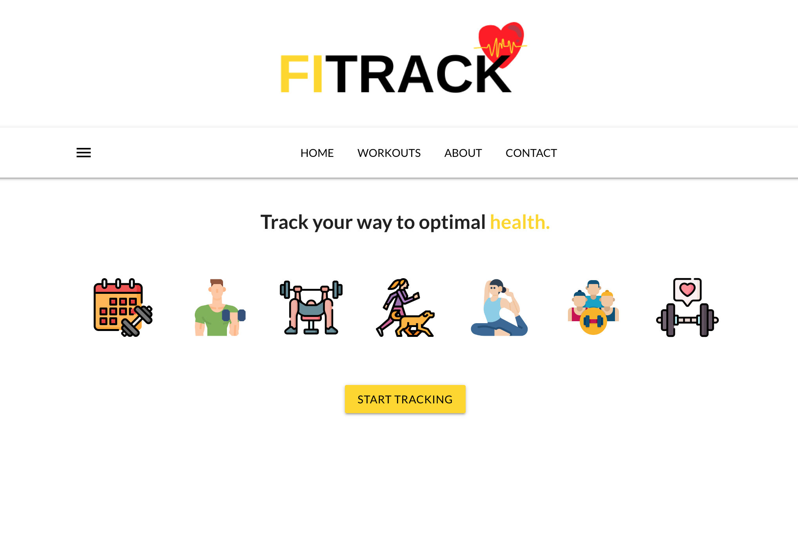

# FITRACK

*FITRACK* is a fitness diary web application that allows users to document their daily workouts.  

## Technologies Used

- JavaScript
- React
- Node.js
- Express
- MongoDB
- HTML
- CSS

## Getting Started

Click here to render the app on Heroku:

[Go to FITrack](https://fitrk.herokuapp.com)

Currently working on the app to:

- Add user authentication

